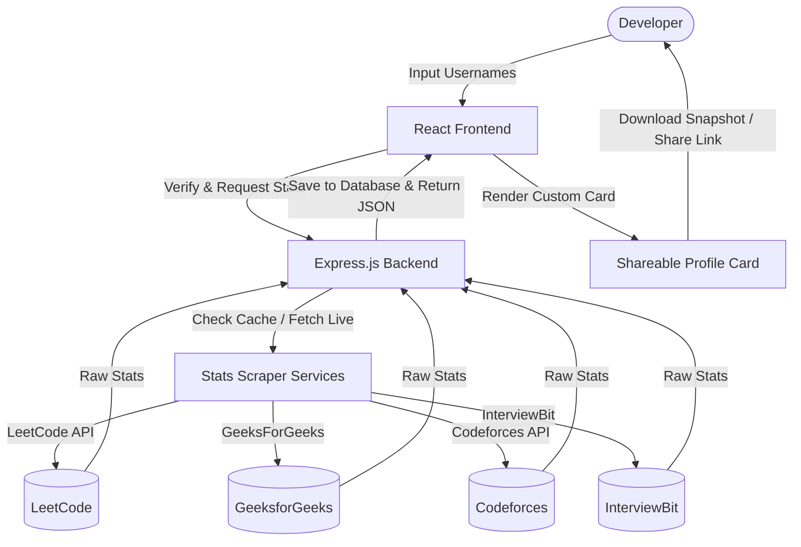

# 📊 DSAlytics

[](https://www.typescriptlang.org/)
[](https://react.dev/)
[](https://nodejs.org/)
[](https://www.mongodb.com/)
[](https://tailwindcss.com/)

**DSAlytics** is a premium, unified developer dashboard that aggregates your Data Structures and Algorithms (DSA) statistics and rankings from top-tier coding platforms—including **LeetCode, GeeksforGeeks, Codeforces, and InterviewBit**—into a single, gorgeous profile card. 

Showcase your achievements, track progress in real-time, customize your themes, and download beautiful image cards to share with recruiters or post on social networks.

---

## 🗺️ Architectural Workflow

Here is how DSAlytics processes and aggregates your profile data:



---

## ✨ Key Features

* **Platform Aggregation**: Instantly gather rankings, problems solved count, and ratings from **LeetCode, GeeksforGeeks, Codeforces, and InterviewBit**.
* **Personalized Profiles**: Generate a unique public link (e.g., `/preview/userid`) displaying your aggregated progress.
* **Premium Customizations**: Choose from stunning predesigned backgrounds (Dark/Light Grid, Dot Grid, Purple Gradient, Masked Dots, Grid with Glow).
* **Export & Download**: High-quality PNG rendering of your developer card with one-click export (powered by `html2canvas`).
* **Intelligent Caching**: Optimized scraping systems that cache fetched stats to ensure lightning-fast profile loads and respect platform rate limits.
* **Clean UI/UX**: Crafted with modern typography, smooth glassmorphism containers, and polished micro-animations using `Framer Motion`.

---

## 🛠️ Tech Stack

* **Frontend**: React 18, TypeScript, Tailwind CSS, Framer Motion, Lucide Icons, React Router DOM.
* **Backend**: Node.js, Express.js, TypeScript, Mongoose, JWT Authentication, Express Rate Limit.
* **Database**: MongoDB (User metadata & platforms cache).
* **Deployment**: Configured for quick hosting via **Vercel** (both frontend and backend routes).

---

## 🚀 Getting Started & Installation

### Prerequisites
* [Node.js](https://nodejs.org/) (v18 or higher recommended)
* [MongoDB](https://www.mongodb.com/) (Local installation or MongoDB Atlas URI)

### Local Development Setup

#### 1. Clone the repository
```bash
git clone https://github.com/prashant4840/DSAlytics.git
cd dsalytics
```

#### 2. Backend Setup
1. Navigate to the backend directory:
   ```bash
   cd backend
   ```
2. Install dependencies:
   ```bash
   npm install
   ```
3. Create a `.env` file in the `backend/` directory:
   ```env
   PORT=5000
   MONGO_URI=your_mongodb_connection_string
   JWT_SECRET=your_jwt_secret_key
   FRONTEND_URL=http://localhost:5173
   ```
4. Run the development server:
   ```bash
   npm run dev
   ```

#### 3. Frontend Setup
1. Navigate to the frontend directory:
   ```bash
   cd ../frontend
   ```
2. Install dependencies:
   ```bash
   npm install
   ```
3. Create a `.env` file in the `frontend/` directory:
   ```env
   VITE_API_URL=http://localhost:5000
   VITE_LEETCODE=https://leetcode.com/u/
   VITE_GFG=https://www.geeksforgeeks.org/user/
   VITE_CODEFORCES=https://codeforces.com/profile/
   VITE_INTERVIEWBIT=https://www.interviewbit.com/profile/
   ```
4. Start the Vite development server:
   ```bash
   npm run dev
   ```
5. Open [http://localhost:5173](http://localhost:5173) in your browser.

---

## 📈 Future Enhancements

* [ ] Add support for competitive programming platforms like **AtCoder, HackerRank, and CodeChef**.
* [ ] Detailed historical analytics displaying month-over-month problem-solving progress.
* [ ] Customizable layout panels allowing developers to rearrange platform cards.
* [ ] Dynamic leaderboard showing ranking comparison among your friends.

---

## 📄 License
This project is licensed under the **ISC License**.
